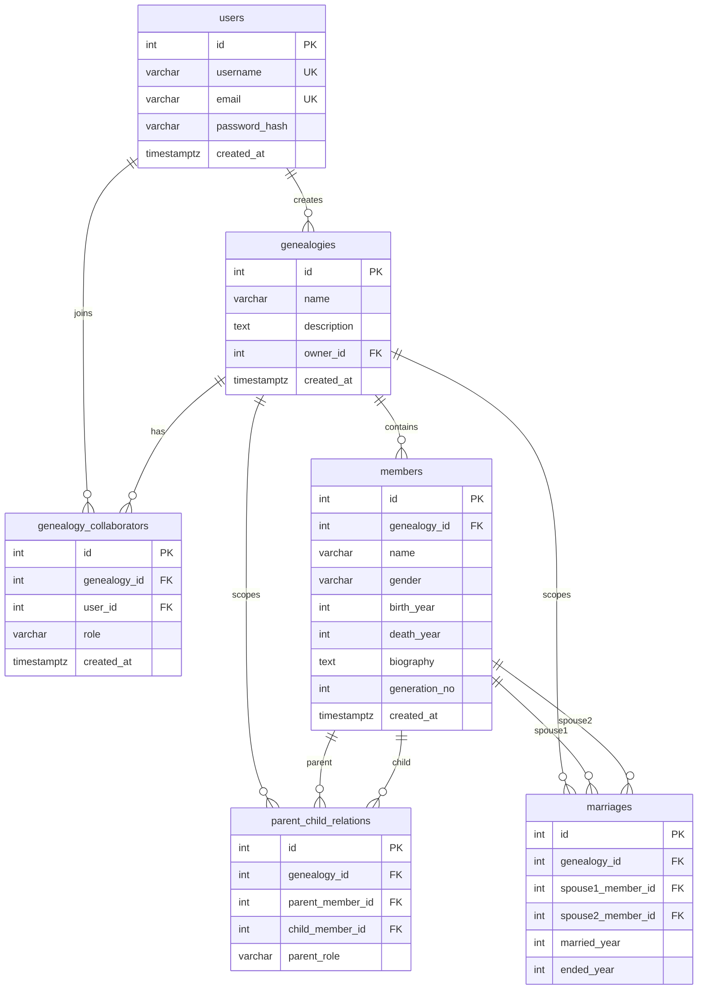

# 数据模型说明

本文档用于课程报告中的 E-R 图、关系模式、约束策略和 3NF 说明。

## E-R 图

## 关系模式

- `users(id, username, email, password_hash, created_at)`
  - 主键：`id`
  - 候选键：`username`、`email`

- `genealogies(id, name, description, owner_id, created_at)`
  - 主键：`id`
  - 外键：`owner_id -> users(id)`

- `genealogy_collaborators(id, genealogy_id, user_id, role, created_at)`
  - 主键：`id`
  - 外键：`genealogy_id -> genealogies(id)`、`user_id -> users(id)`
  - 唯一约束：`(genealogy_id, user_id)`

- `members(id, genealogy_id, name, gender, birth_year, death_year, biography, generation_no, created_at)`
  - 主键：`id`
  - 外键：`genealogy_id -> genealogies(id)`
  - 说明：同名成员允许存在，业务查询以 `id` 区分身份。

- `parent_child_relations(id, genealogy_id, parent_member_id, child_member_id, parent_role)`
  - 主键：`id`
  - 外键：`genealogy_id -> genealogies(id)`、`parent_member_id -> members(id)`、`child_member_id -> members(id)`
  - 唯一约束：`(parent_member_id, child_member_id)`、`(child_member_id, parent_role)`

- `marriages(id, genealogy_id, spouse1_member_id, spouse2_member_id, married_year, ended_year)`
  - 主键：`id`
  - 外键：`genealogy_id -> genealogies(id)`、`spouse1_member_id -> members(id)`、`spouse2_member_id -> members(id)`
  - 唯一约束：`(spouse1_member_id, spouse2_member_id)`

## 约束策略

- 行内约束使用 `CHECK`：
  - `members.gender IN ('male', 'female', 'unknown')`
  - `members.death_year >= members.birth_year`
  - `members.generation_no >= 1`
  - `parent_child_relations.parent_member_id <> child_member_id`
  - `parent_child_relations.parent_role IN ('father', 'mother')`
  - `marriages.spouse1_member_id < spouse2_member_id`
  - `marriages.ended_year >= married_year`

- 跨行约束使用 PostgreSQL 触发器：
  - 父母与子女必须属于同一族谱。
  - 父母代数必须小于子女代数。
  - 父母出生年必须早于子女出生年。
  - 配偶双方必须属于同一族谱。
  - 更新成员的 `genealogy_id`、`birth_year`、`generation_no` 时，不能破坏已有父子或婚姻关系。

- 多值关系拆为独立表：
  - 多用户协作关系拆为 `genealogy_collaborators`。
  - 父母子女关系拆为 `parent_child_relations`。
  - 婚姻关系拆为 `marriages`。

## 3NF 说明

本系统的核心表均满足第三范式。

- `users` 中的非主属性 `username`、`email`、`password_hash`、`created_at` 只依赖用户主键 `id`，不存在对其他非主属性的传递依赖。
- `genealogies` 中的 `name`、`description`、`owner_id`、`created_at` 均描述一个族谱实体，只依赖 `id`。
- `genealogy_collaborators` 表达用户与族谱之间的协作关系，`role` 依赖协作关系本身，不依赖用户或族谱的其他非主属性。
- `members` 中姓名、性别、生卒年、生平简介、代数均描述成员实体；父母、配偶等多值关系未冗余存入该表。
- `parent_child_relations` 仅保存父母子女关系事实，`parent_role` 依赖这条关系本身，不冗余保存父母或子女姓名。
- `marriages` 仅保存配偶关系事实和年份，不冗余保存配偶姓名、性别等成员属性。

因此，各表不存在非主属性对主键的部分依赖或传递依赖；多值事实被拆分为独立关系表，避免更新异常、插入异常和删除异常。

## 索引说明

- `ix_members_name_trgm`：使用 `pg_trgm + GIN` 支持姓名模糊搜索。
- `ix_parent_child_genealogy_parent`：支持从父节点查询子节点，用于后代树和树形预览。
- `ix_parent_child_genealogy_child`：支持从子节点查询父节点，用于祖先树。
- `ix_marriages_genealogy_spouse1`、`ix_marriages_genealogy_spouse2`：支持从任一成员快速查询配偶关系。
